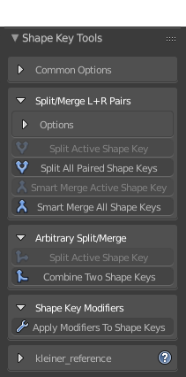

# Shape Key Tools for Blender 2.79

### Some basic tools for manipulating shape keys beyond Blender's limited abilities.

* Split paired shape keys into left & right halves. Merge left & right shape key pairs together.
* Combine shape keys with various blend modes and per-vertex filtering
* Split shape keys with per-vertex filtering
* Apply modifiers to meshes with shape keys

"Officially" compatible with Blender 2.78-2.79, but it should work on older versions (possibly up to 2.75).
 
## Split & Merge Shape Key Pairs
Split and merge shape key pairs, using a `MyShapeKeyL+MyShapeKeyR` naming convention.
* Useful for separating and combining the left and right halves of expressions, such as eyebrow, eye, and mouth shapes.
* Choose the world axis that defines the "left" and "right" sides of the model.

#### Split/merge any L or R shape key with its counterpart

#### Split/merge all shape key pairs at once

## Combine shape keys
Combine two shapes keys together with a variety of Photoshop-like blending modes and vertex filtering options.
* Useful when you don't want to fuss with the shape key panel and "New Shape Key From Mix", or when Blender's only ability to additively blend all verts is not desirable.
* Blend modes: `add`, `subtract`, `multiply`, `divide`, `overwrite`, `lerp`
* Vertex filtering "masks" which verts are blending together, using the shape key's characteristics or the model's vertex groups.

## Split shape keys
Split off a new shape key from an existing shape key, using various options to filter the result on a per-vertex basis.
* Useful for extracting a specific part of a shape key.
* Vertex filtering "masks" which verts are split off, using the shape key's characteristics or the model's vertex groups.

## Apply modifiers to meshes with shape keys
Apply modifiers to meshes with shape keys, baking the modifier into both the base mesh and the shape key deltas.
* Useful when you don't want to recreate 100 blend shapes just because Blender doesn't know how to deform shape keys.
* Multiple modifiers can be applied at once, in stack order.
* Only vertex-preserving modifiers are compatible. Modifiers which change topology or vertex count cannot be applied.

